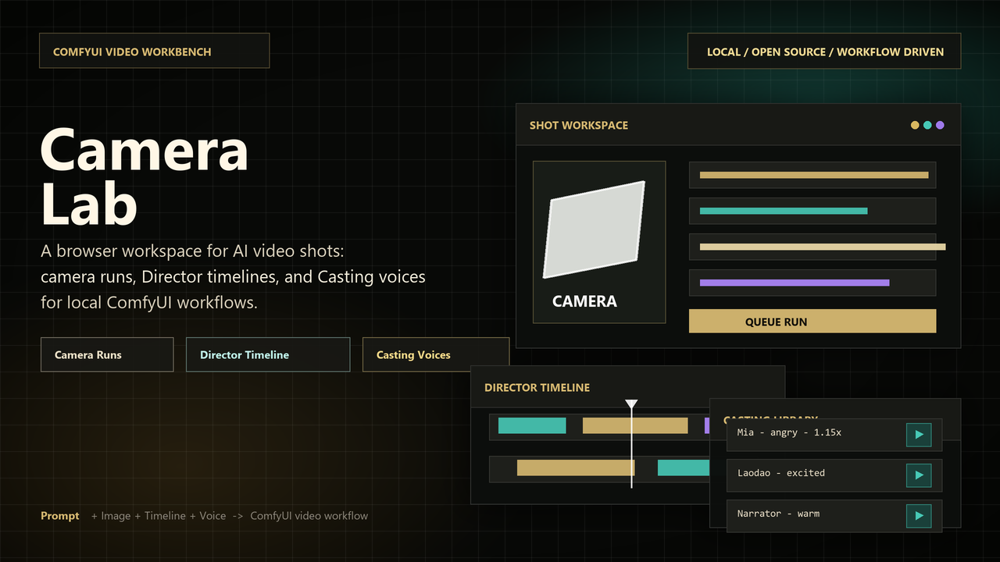
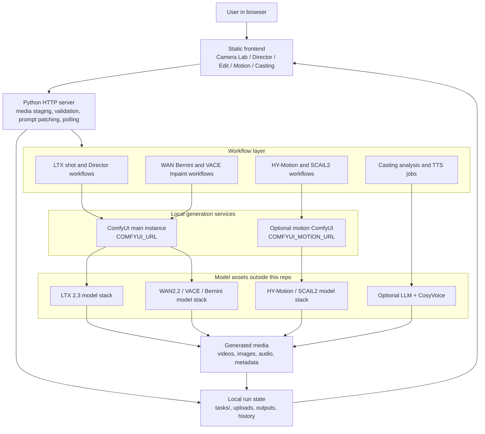
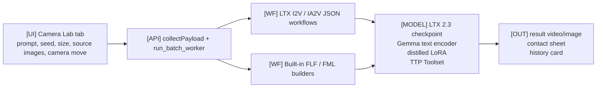
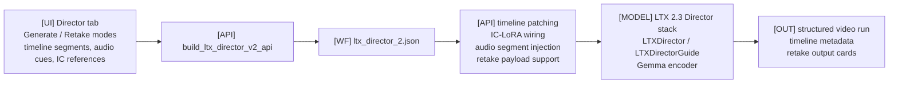
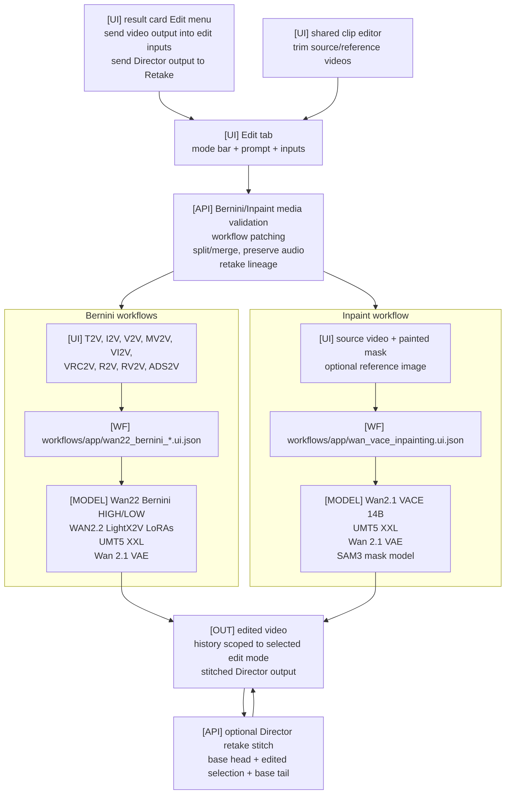
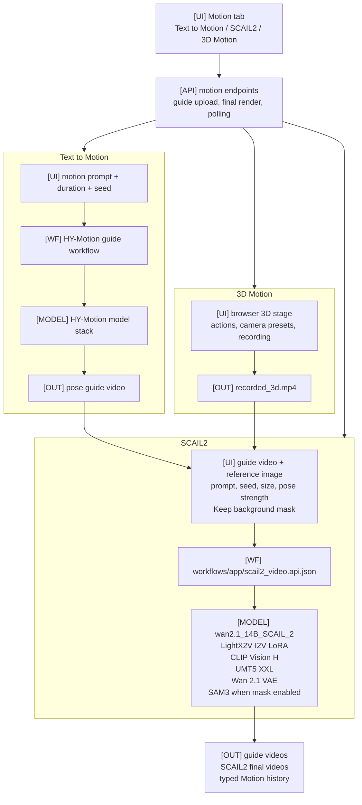
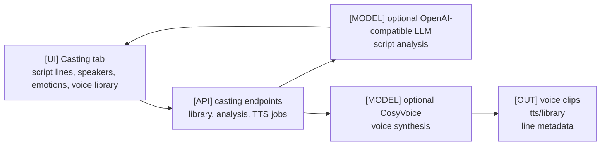

# Camera Lab

Camera Lab is a local web workspace for building ComfyUI-powered AI video shots. It combines prompt-driven video generation, Director-style timeline assembly, and Casting voice preparation in one browser UI.

It runs as a lightweight Python HTTP server, serves a static frontend, and submits patched workflow prompts to a local ComfyUI instance.



## System Architecture



## What It Does

- **Camera Lab** queues image-to-video and multi-image workflow runs with reusable camera move presets, prompts, seeds, reference images, and result history.
- **Director** assembles shot timelines, audio cues, IC reference clips, and LTX Director 2 settings for longer structured video runs. It also has a Retake lane for selecting part of an existing Director output and sending that range to Edit.
- **Edit** groups WAN2.2 Bernini video editing modes and WAN VACE Inpaint into one workspace. Bernini supports T2V, I2V, V2V, MV2V, VI2V, VRC2V, R2V, RV2V, and ADS2V modes; Inpaint lets you upload a source video, paint a replacement mask, and optionally provide a reference image. Retake-sourced edit runs can be stitched back into the original Director output.
- **Casting** turns scripts into dialogue lines, assigns character voices and emotions, generates voice clips with CosyVoice when available, and keeps the voice library usable even when optional analysis or TTS services are offline.
- **Motion** drives the SCAIL-2 video model to animate a reference character from a guide pose video. It has three tools: **Text to Motion** (HY-Motion turns a text prompt into a pose video), **SCAIL2** (renders a pose video onto a reference character), and **3D Motion** (poses a rigged 3D character in the browser, then feeds that as the guide).

## Beginner Installation Guide

The easiest way to start is the launcher:

```powershell
python scripts/launch.py
```

The launcher checks your GPU, VRAM, ComfyUI connection, module readiness, and model visibility. It does **not** download models, install ComfyUI, or change your existing ComfyUI installation.

### What Is Docker?

Docker is an app that runs software in isolated containers. A container is like a small, packaged environment for an app and its dependencies. Camera Lab can use Docker so ComfyUI and/or Camera Lab run without being mixed into your normal Python environment.

You do **not** need Docker if you already have ComfyUI installed and you are comfortable running Camera Lab directly with Python. In that case, choose:

```text
Existing ComfyUI + native Camera Lab
```

You may want Docker if:

- You do not have ComfyUI installed yet.
- You want Camera Lab or ComfyUI isolated from your normal Python setup.
- You are comfortable installing Docker Desktop and letting Docker manage containers.

If the word "Docker" is new to you, the simplest path is usually:

1. Install ComfyUI normally using the official ComfyUI instructions.
2. Use Camera Lab's `Existing ComfyUI + native Camera Lab` mode.

If you still want the all-in-one container path, install Docker Desktop first:

- Windows/macOS: <https://www.docker.com/products/docker-desktop/>
- Linux Docker Engine: <https://docs.docker.com/engine/install/>

If you are not sure what will happen, run a safe dry run first:

```powershell
python scripts/launch.py --assess-only
python scripts/launch.py --dry-run
```

`--assess-only` only prints the hardware/module/model report. `--dry-run` prints the commands it would run without starting Docker or Camera Lab.

### Step 1: Choose Your Install Path

Camera Lab supports four install paths:

| Your situation | What runs natively | What runs in Docker | Launcher mode |
|---|---|---|---|
| You already have ComfyUI and want the simplest setup | ComfyUI + Camera Lab | Nothing | `no-docker` |
| You already have ComfyUI but want Camera Lab isolated | ComfyUI | Camera Lab | `cam-lab-only-docker` |
| You do not have ComfyUI but want Camera Lab native | Camera Lab | ComfyUI | `comfy-only-docker` |
| You do not have ComfyUI and want everything isolated | Nothing | ComfyUI + Camera Lab | `full-docker` |

For beginners:

- If you already use ComfyUI, start with `no-docker`.
- If you do not have ComfyUI, start with `full-docker`.
- Use `comfy-only-docker` only if you specifically want ComfyUI in Docker but Camera Lab running directly on your machine.
- Use `cam-lab-only-docker` only if your existing ComfyUI is already reachable from Docker. Your ComfyUI must listen on `0.0.0.0`, usually by starting it with `--listen`.

### Step 2: Check What Camera Lab Sees

Run:

```powershell
python scripts/launch.py --assess-only
```

You should see something like:

```text
Hardware: GPU=NVIDIA GeForce RTX 4090, VRAM=24 GiB, OS=Windows
ComfyUI detected: yes
Modules:
  camera   ready=True  feasibility=fits
  director ready=True  feasibility=fits
```

The model guide uses these tags:

- `[ok]`: ComfyUI can already see the model.
- `[missing]`: ComfyUI is running, but this model is missing.
- `[needed]`: ComfyUI was not detected, so Camera Lab can only show what will be needed later.

Model paths are shown relative to your ComfyUI models folder. For example:

```text
models/checkpoints/ltx-2.3-22b-dev-fp8.safetensors
```

means:

```text
<your ComfyUI folder>/models/checkpoints/ltx-2.3-22b-dev-fp8.safetensors
```

For Docker modes, `MODELS_DIR` is the host folder that contains those model subfolders. Docker mounts it inside the ComfyUI container at:

```text
/opt/ComfyUI/models
```

### Step 3A: Existing ComfyUI + Native Camera Lab

Use this path if you already have ComfyUI installed and running.

1. Start ComfyUI.
2. Make sure it is reachable at the URL Camera Lab will use, usually:

   ```text
   http://127.0.0.1:8000
   ```

3. Create `.env` if it does not exist:

   ```powershell
   Copy-Item .env.example .env
   ```

4. Edit `.env`:

   ```text
   COMFYUI_ROOT=C:\path\to\your\ComfyUI
   COMFYUI_URL=http://127.0.0.1:8000
   ```

5. Install repo dependencies and workflows:

   ```powershell
   python scripts/agent_setup.py
   python scripts/install_workflows.py
   python scripts/check_setup.py
   ```

6. Preview the launch:

   ```powershell
   python scripts/launch.py --dry-run --mode no-docker
   ```

7. Start Camera Lab:

   ```powershell
   python scripts/launch.py --mode no-docker
   ```

### Step 3B: Existing ComfyUI + Docker Camera Lab

Use this path if you want Camera Lab in Docker but want to keep using your existing ComfyUI.

1. Start ComfyUI with network listening enabled:

   ```powershell
   python main.py --listen 0.0.0.0 --port 8000
   ```

2. Copy the Camera Lab Docker env file:

   ```powershell
   Copy-Item docker\compose.camera-lab-only.env.example docker\compose.camera-lab-only.env
   ```

3. Edit `docker/compose.camera-lab-only.env`.

   Set the ComfyUI URL to an address the container can reach. On Docker Desktop, this is often:

   ```text
   COMFYUI_URL=http://host.docker.internal:8000
   ```

4. Preview the launch:

   ```powershell
   python scripts/launch.py --dry-run --mode cam-lab-only-docker
   ```

5. Start Camera Lab:

   ```powershell
   python scripts/launch.py --mode cam-lab-only-docker
   ```

### Step 3C: Docker ComfyUI + Native Camera Lab

Use this path if you do not have ComfyUI installed, but you want Camera Lab to run directly on your machine.

1. Copy the ComfyUI Docker env file:

   ```powershell
   Copy-Item docker\compose.comfy-only.env.example docker\compose.comfy-only.env
   ```

2. Edit `docker/compose.comfy-only.env`:

   ```text
   MODELS_DIR=C:\path\to\your\ComfyUI\models
   COMFY_DATA_DIR=.\comfy-data
   COMFY_PORT=8188
   ```

   `MODELS_DIR` must point to a host folder that contains ComfyUI model subfolders like `checkpoints`, `diffusion_models`, `text_encoders`, `vae`, and `loras`.

   `COMFY_DATA_DIR` is where the containerized ComfyUI reads inputs and writes outputs:

   ```text
   COMFY_DATA_DIR/input  -> /opt/ComfyUI/input
   COMFY_DATA_DIR/output -> /opt/ComfyUI/output
   ```

   The launcher also passes this same `COMFY_DATA_DIR` to native Camera Lab as `COMFYUI_ROOT`, so uploads land where the ComfyUI container can read them.

3. Install native Camera Lab dependencies:

   ```powershell
   python scripts/agent_setup.py
   ```

4. Preview the launch:

   ```powershell
   python scripts/launch.py --dry-run --mode comfy-only-docker
   ```

   The dry run should show:

   ```text
   env COMFYUI_URL=http://127.0.0.1:8188
   env COMFYUI_ROOT=...
   ```

5. Start ComfyUI in Docker and Camera Lab natively:

   ```powershell
   python scripts/launch.py --mode comfy-only-docker
   ```

### Step 3D: Docker ComfyUI + Docker Camera Lab

Use this path if you want the most isolated setup.

1. Copy the full Docker env file:

   ```powershell
   Copy-Item docker\compose.env.example docker\compose.env
   ```

2. Edit `docker/compose.env`:

   ```text
   MODELS_DIR=C:\path\to\your\ComfyUI\models
   ```

   Docker mounts this folder into the ComfyUI container at:

   ```text
   /opt/ComfyUI/models
   ```

3. Preview the launch:

   ```powershell
   python scripts/launch.py --dry-run --mode full-docker
   ```

4. Start both services:

   ```powershell
   python scripts/launch.py --mode full-docker
   ```

5. Open Camera Lab:

   ```text
   http://127.0.0.1:8000
   ```

### Step 4: Fix Common Setup Problems

**ComfyUI was not detected**

- Start ComfyUI first.
- Check that `COMFYUI_URL` is correct.
- For `cam-lab-only-docker`, start ComfyUI with `--listen 0.0.0.0` and use a container-reachable URL such as `http://host.docker.internal:8000`.

**MODELS_DIR is missing or does not exist**

- Edit the relevant Docker env file.
- Set `MODELS_DIR` to the host folder that contains your ComfyUI model subfolders.
- Do not point it at one model file; point it at the whole `models` folder.

**A model is listed as missing**

- Download or copy that model manually.
- Put it at the path shown by the model guide.
- Restart or refresh ComfyUI if it does not see the new model.

**Docker is not available or not running**

- Start Docker Desktop on Windows or macOS.
- On Linux, make sure the Docker daemon is running.
- For NVIDIA GPUs in Docker, verify GPU passthrough with:

  ```powershell
  docker run --rm --gpus all nvidia/cuda:12.4.1-base-ubuntu22.04 nvidia-smi
  ```

**PowerShell blocks scripts**

Run this once:

```powershell
Set-ExecutionPolicy -Scope CurrentUser RemoteSigned
```

### Step 5: Stop Services

For native Camera Lab:

```powershell
python scripts/stop_camera_lab.py
```

For Docker modes:

```powershell
docker compose --env-file docker/compose.env down
docker compose -f docker-compose.comfy-only.yml --env-file docker/compose.comfy-only.env down
docker compose -f docker-compose.camera-lab-only.yml --env-file docker/compose.camera-lab-only.env down
```

## Tab Architecture

Legend used in the tab diagrams:

- `[UI]`: browser controls in `frontend/`
- `[API]`: request handling and prompt patching in `server/camera_lab_server.py`
- `[WF]`: bundled workflow JSON or server-side workflow builder
- `[MODEL]`: local ComfyUI model files and custom nodes
- `[OUT]`: generated run files and history under `tasks/`

### Camera Lab Tab

**High-level overview:**



**High-level description:** Camera Lab is the core shot-generation workspace for creating short AI video clips from prompts, image references, camera moves, and reusable LTX workflow presets. The browser collects prompt, seed, frame size, duration, camera move, and source images, then the Python server validates media, patches the selected LTX workflow or built-in workflow builder, submits it to ComfyUI, and records generated media back into run history.

### Director Tab

**High-level overview:**



**High-level description:** Director is the structured timeline workspace for assembling longer videos from ordered main segments, IC reference clips, prompts, and audio cues. Generate mode builds a Director v2 timeline payload and the backend converts it into `LTXDirector` inputs. Retake mode loads one existing video, lets the user choose a time range, and can either queue native Director retake or send the selected range into Edit for Bernini/Inpaint processing and automatic stitching back into a full Director output.

### Edit Tab

**High-level overview:**



**High-level description:** Edit is the post-generation editing workspace for changing existing images or videos through Bernini modes and masked VACE inpainting. The UI routes users into Bernini or Inpaint modes, gathers source media, reference media, masks, prompts, split settings, trim data, and optional retake context, then the backend stages those assets, patches the corresponding WAN workflow, optionally preserves audio or merges split RV2V segments, and saves edited results into scoped history cards. When an edit run carries Director retake context, Camera Lab can stitch the edited selection back into the original video and show the stitched result in Director output.

### Motion Tab

**High-level overview:**



**High-level description:** Motion is the character-motion workspace for turning text, uploaded guide videos, or browser-recorded 3D motion into SCAIL2 character animation. Text to Motion produces pose guide videos, 3D Motion records browser-generated guide clips, and SCAIL2 combines a guide video with a reference character image; the backend patches motion workflows, handles reference masks and pose masks, polls the motion ComfyUI endpoint, and stores guide/final videos by motion subtype.

### Casting Tab

**High-level overview:**



**High-level description:** Casting is the dialogue and voice-preparation workspace for converting scripts into speaker lines, voice assignments, emotion metadata, and generated speech clips. The UI manages script lines and voice-library state, while optional LLM analysis can structure dialogue and optional CosyVoice synthesis can render audio; the server keeps these integrations isolated so the tab remains usable when either external dependency is unavailable.

## Quick Start

For a fresh local setup, start with the module-aware installer:

```powershell
python scripts/install_camera_lab.py --all
python scripts/check_setup.py
```

On Windows, you can start from the repository root even if Python is not installed:

```powershell
.\install_camera_lab.ps1
```

If Python is not installed, this bootstrap script uses `winget` to install Python 3.12, then runs the same module-aware installer. A double-click friendly `install_camera_lab.bat` wrapper is also available.

To inspect or install only selected modules:

```powershell
python scripts/install_camera_lab.py --list-modules
python scripts/install_camera_lab.py --modules camera,director
python scripts/check_setup.py --modules director
```

Edit `.env` after the installer creates it if `COMFYUI_ROOT` is still the placeholder value. The installer evaluates local hardware, installs repo dependencies, and installs bundled workflows when `COMFYUI_ROOT` is valid. It does not install ComfyUI, models, or custom nodes.

For coding-agent compatibility, the older commands still work:

```powershell
python scripts/agent_setup.py
python scripts/install_workflows.py
python scripts/check_setup.py
```

### 1. Requirements

- Windows, macOS, or Linux
- Python 3.10 or newer
- A working local ComfyUI install

Use `python3` instead of `python` on systems where the `python` command is not available.

If you do not have ComfyUI yet, install it first:

- Comfy Desktop: <https://docs.comfy.org/installation/desktop/overview>
- Manual local install: <https://docs.comfy.org/installation/manual_install>
- Source repository: <https://github.com/comfy-org/comfyui>

Camera Lab can install its own Python and Node dependencies, but it does not install ComfyUI, ComfyUI models, or custom nodes. Without ComfyUI, you can inspect the repo and run repo-only tests, but video generation and full setup checks will fail.

Start ComfyUI first. Camera Lab expects ComfyUI to be reachable at:

```text
http://127.0.0.1:8000
```

### 2. Create Local Config

Copy the example config:

```powershell
Copy-Item .env.example .env
```

Edit `.env` and set your own ComfyUI folder:

```text
COMFYUI_ROOT=<path-to-your-ComfyUI>
COMFYUI_URL=http://127.0.0.1:8000
```

The **Motion** workspace can use a separate ComfyUI instance that hosts the HY-Motion and SCAIL-2 nodes. It is optional: leave it unset to route Motion through the main `COMFYUI_URL`, or point it at a dedicated instance.

```text
COMFYUI_MOTION_URL=http://127.0.0.1:8188
COMFYUI_MOTION_ROOT=<path-to-your-ComfyUI-scail>
```

Do not commit `.env`. It is ignored by git because it is machine-specific.

### 3. Install Python Dependency

```powershell
python -m pip install -r requirements.txt
```

### 4. Install Bundled Workflows into ComfyUI

Camera Lab stores workflow files in this repo, but ComfyUI only sees workflows that are inside your local ComfyUI workflow folder.

Install bundled app workflows into:

```text
<COMFYUI_ROOT>/user/default/workflows/camera-lab/
```

Run:

```powershell
python scripts/install_workflows.py
```

To install only selected module workflows:

```powershell
python scripts/install_workflows.py --modules camera,director
```

To also install experimental Director / IC-LoRA workflows:

```powershell
python scripts/install_workflows.py --include-experimental
```

Restart or refresh ComfyUI if its workflow browser does not show the new files.

### 5. Check Setup

Run:

```powershell
python scripts/check_setup.py
```

To check only selected modules:

```powershell
python scripts/check_setup.py --modules director
```

If a check says `MISSING`, fix that item before starting Camera Lab. The most common issues are:

- `.env` was not created
- `COMFYUI_ROOT` points to the wrong folder
- ComfyUI is not running
- Required LTX models are missing
- Required custom nodes or workflow files are missing
- Bundled workflows were not installed into ComfyUI

### 6. Start Camera Lab

```bash
python scripts/start_camera_lab.py --open
```

Default URL:

```text
http://127.0.0.1:1234
```

Use another port if needed:

```bash
python scripts/start_camera_lab.py -p 9000 --open
```

### 7. Stop Camera Lab

```bash
python scripts/stop_camera_lab.py
```

Use a custom port if you started one:

```bash
python scripts/stop_camera_lab.py -p 9000
```

Windows PowerShell wrappers are also available:

```powershell
.\scripts\agent_setup.ps1
.\scripts\install_workflows.ps1
.\scripts\check_setup.ps1
.\scripts\start_camera_lab.ps1 -Open
```

## If PowerShell Blocks Scripts

Run this once for your Windows user:

```powershell
Set-ExecutionPolicy -Scope CurrentUser RemoteSigned
```

You can also start the server directly:

```powershell
python server\camera_lab_server.py --port 1234
```

Then open:

```text
http://127.0.0.1:1234
```

## Casting Workspace Dependencies

The Casting workspace is optional and degrades safely. Camera Lab's server and UI can start without an LLM endpoint and without CosyVoice. When those dependencies are missing, the Casting tab still opens, shows a setup warning, and keeps manual line editing and the existing voice library UI available.

Casting has two independent dependency groups:

- **LLM dialogue analysis**: used only by the `Analyze` button to turn a script into short voice lines. It can use any OpenAI-compatible chat completions endpoint.
- **CosyVoice TTS generation**: used only by per-line and `Generate all` speech synthesis. It runs on demand in the configured CosyVoice Python environment.

Configure the LLM endpoint in `.env`:

```text
LLM_URL=http://127.0.0.1:1234/v1
LLM_MODEL=gpt-oss-20b
LLM_API_KEY=
```

Examples:

- LM Studio: `LLM_URL=http://127.0.0.1:1234/v1`
- Ollama: `LLM_URL=http://127.0.0.1:11434/v1` and `LLM_MODEL=gpt-oss:20b`
- Hosted OpenAI-compatible APIs: set `LLM_URL`, `LLM_MODEL`, and `LLM_API_KEY`

Configure CosyVoice in `.env`:

```text
COSYVOICE_PYTHON=python
COSYVOICE_MODEL_DIR=tts/models/Fun-CosyVoice3-0.5B
COSYVOICE_VENDOR=tts/cosyvoice
CASTING_VOICES_DIR=tts/voices
```

Expected local Casting paths:

- `tts/cosyvoice`: a CosyVoice source checkout, symlink, or junction
- `tts/models/Fun-CosyVoice3-0.5B`: the local CosyVoice model folder
- `tts/voices`: reference voice `.wav` files with matching `.txt` transcripts
- `scripts/casting_tts.py`: the repo-side one-shot synthesis helper

If only the LLM is missing, script analysis is disabled but manual line editing still works. If only CosyVoice is missing, TTS generation is disabled but script analysis can still work. If both are missing, Camera Lab still starts and the Casting tab reports both missing dependency groups.

## Director Workspace

Director uses `LTX Director 2` as the app-facing workflow.

Generate mode:

- The main timeline accepts text/image segments and video clips.
- Video clips are treated as visual guides and default to the uploaded video's duration.
- The video-audio lane can hold extracted or uploaded audio, and the dialogue lane can hold separate dialogue audio.
- The IC video lane holds reference clips for the selected IC-LoRA. If no IC-LoRA is selected, that lane is inert.
- Global prompt, negative prompt, seed, preset size, scale, and custom frame size live beside the preview player.

Retake mode:

- A generated video can be sent to Retake from a result card's **Edit** menu.
- The Retake timeline holds one base video and a draggable/resizable selection range.
- The selected range can be sent to Edit modes such as V2V, MV2V, VI2V, VRC2V, RV2V, ADS2V, or Inpaint.
- Retake-sourced edit runs carry a unique `retake_id`, the source range, the base video dimensions, and the selected duration.
- When auto-stitch is enabled, Camera Lab stitches `base before selection + edited selection + base after selection` and adds the full stitched video back to Director output.
- Native Director retake still uses the LTX Director retake payload (`retake_video`, `retake_start`, `retake_length`, `retake_prompt`, and `retake_strength`).

Known behavior:

- Director v2 global reference images are currently placeholder UI. They are not wired as active Director v2 image inputs yet.
- IC-LoRA behavior depends on the installed LoRA. The generic IC video lane does not turn raw footage into motion control unless the selected IC-LoRA expects that kind of control input.
- Result polling avoids refreshing while an output video is playing, so playback does not jump between result cards.

## Edit Workspace

The Edit workspace is the shared UI for Bernini and Inpaint workflows.

Bernini modes:

- **T2V**: text to video.
- **I2V**: source image to video.
- **V2V / MV2V / VRC2V**: source video edits.
- **VI2V / RV2V**: source video edits with a reference image.
- **R2V**: reference image to video.
- **ADS2V**: source video plus reference video.

Inpaint mode:

- Requires a source video and a painted mask.
- Reference image is optional.
- The mask is drawn in the center canvas and uploaded before the workflow is queued.
- The backend builds the WAN VACE control video by masking out the painted region, so the model receives the preserved source context and a clear replacement area.
- For retake handoff, the selected range duration and source frame size are carried into Edit. Bernini preserve-audio defaults on for retake-sourced clips.

Generated video result cards include an **Edit** menu when the output can be reused as an input. The menu can send a result video into compatible Bernini or Inpaint source slots, or into Director Retake when the result is a video output. Video upload fields share the same clip editor modal so a trimmed clip can be reused consistently across Edit and Motion inputs.

## Browser E2E Tests

Camera Lab uses Playwright for browser-level smoke tests of the web UI.

Install Node dependencies and the Chromium test browser:

```powershell
npm install
npx playwright install chromium
```

Run the E2E suite:

```powershell
npm run test:e2e
```

The E2E suite starts the local server and verifies the public workspaces, Director timeline behavior, and Casting UI fallback states.

## Expected ComfyUI Layout

Camera Lab reads these paths from `COMFYUI_ROOT`:

- `input`
- `output`
- `models`
- `user/default/workflows`
- `custom_nodes/Comfyui_TTP_Toolset`

The setup checker verifies the important paths and files.

## Workflow Sources

The frontend workflow dropdown is populated by `WORKFLOWS` in `server/camera_lab_server.py`.

Current workflow sources are:

- Runtime builders in `server/camera_lab_server.py`.
- App-owned workflow JSON files under `workflows/app/`.

Files under `workflows/app/` are the workflow files shipped with Camera Lab. Run `python scripts/install_workflows.py` to copy them into ComfyUI for direct inspection, import, or manual queueing. Files under `workflows/experimental/` are optional research references and are only installed with `--include-experimental`.

Current dropdown mapping:

- `LTX 2.3 I2V Subtitle Cleaner`: `workflows/app/ltx23_i2v_subtitle_cleaner_nag_extend.json`
- `LTX 2.3 FLF (2 images, audio)`: `workflows/app/ltx23_flf_subtitle_cleaner_nag_extend.json`
- `LTX 2.3 FML (3 images, 2-stage, audio)`: built in `server/camera_lab_server.py`
- `LTX 2.3 FML RuneXX Guider Local (3 images)`: `workflows/app/LTX-2.3_FML2V_RuneXX_guider.local.json`
- `LTX 2.3 IA2V`: `workflows/app/ltx23_nag_ia2v_extendcrop_general.json`
- `LTX 2.3 FLF IA2V (2 images + audio)`: `workflows/app/ltx23_flf_ia2v_nag_extend.json`
- `LTX Director 2`: `workflows/app/ltx_director_2.json`
- `WAN2.2 Bernini T2V`: `workflows/app/wan22_bernini_t2v.ui.json`
- `WAN2.2 Bernini T2I`: `workflows/app/wan22_bernini_t2i.ui.json`
- `WAN2.2 Bernini I2V`: `workflows/app/wan22_bernini_i2v.ui.json`
- `WAN2.2 Bernini I2I`: `workflows/app/wan22_bernini_i2i.ui.json`
- `WAN2.2 Bernini V2V`: `workflows/app/wan22_bernini_v2v.ui.json`
- `WAN2.2 Bernini MV2V`: `workflows/app/wan22_bernini_mv2v.ui.json`
- `WAN2.2 Bernini VI2V`: `workflows/app/wan22_bernini_vi2v.ui.json`
- `WAN2.2 Bernini VRC2V`: `workflows/app/wan22_bernini_vrc2v.ui.json`
- `WAN2.2 Bernini R2V`: `workflows/app/wan22_bernini_r2v.ui.json`
- `WAN2.2 Bernini R2I`: `workflows/app/wan22_bernini_r2i.ui.json`
- `WAN2.2 Bernini RV2V`: `workflows/app/wan22_bernini_rv2v.ui.json`
- `WAN2.2 Bernini ADS2V`: `workflows/app/wan22_bernini_ads2v.ui.json`
- `WAN VACE Inpaint`: `workflows/app/wan_vace_inpainting.ui.json`

## Director Reference Notes

Director uses `LTX Director 2` from `workflows/app/ltx_director_2.json`. The older `ltx_director_reference_mvp.json` (v1 MVP) has been retired and removed.

### Global reference status

Director v2 global reference images are placeholder UI in the current app. The active v2 path supports timeline segments, IC reference clips, audio segments, and retake payloads; native global reference image wiring is planned for a later integration pass.

The notes below describe the legacy MVP compatibility path, which is useful when inspecting older runs or the legacy workflow.

### Default path used by Camera Lab

For the legacy Director reference workflow, `build_ltx_director_reference_api(...)` will:

1. Parse timeline payload from the request.
2. Copy global reference files (e.g. `reference_images`) to the ComfyUI input folder.
3. Copy per-segment timeline reference images to ComfyUI input.
4. Populate `LTXDirector` inputs:
   - `global_prompt`
   - `duration_frames`
   - `duration_seconds`
   - `timeline_data`
   - `local_prompts`
   - `segment_lengths`
   - `guide_strength`
   - `frame_rate`
   - `custom_width`
   - `custom_height`

### Native vs. injected compatibility mode

If the loaded ComfyUI node schema exposes both:

- `global_reference_images`
- `global_reference_strength`

on `LTXDirector`, Camera Lab sets those fields directly and skips manual graph rewriting.

If those fields are not present, Camera Lab falls back to a backward-compatible dynamic injection path:

- It creates an `LTXVAddGuideMulti` node at runtime.
- It creates one `LoadImage` node per global reference.
- It connects each reference to:
  - `global reference image`
  - `frame index` (set to `0`, global references apply from start)
  - `strength` (`global_reference_strength` from run payload)
- It rewires downstream guide-consuming sockets so the generated guide data is injected through the newly inserted node.

This fallback behavior is intentional and allows legacy runs to work without custom-node upgrades.

### Practical implication

- If you only want director with legacy global refs, you can use the legacy Camera Lab flow and this dynamic injection will work on supported workflows.
- If your custom `LTXDirector` has been updated upstream with native global-reference inputs, the behavior is cleaner and uses the native socket path automatically.
- If a legacy run appears to have no global reference effect, check:
  - `check_setup.py` status
  - workflow installed in `<COMFYUI_ROOT>/user/default/workflows/camera-lab`
  - whether your ComfyUI `LTXDirector` has been patched with native inputs

## Included

- `server/`: Python backend, local HTTP server, and ComfyUI bridge.
- `frontend/`: static browser UI served by the Python backend.
- `scripts/`: cross-platform Python helpers plus Windows PowerShell wrappers.
- `workflows/app/`: checked-in ComfyUI workflows used by Camera Lab itself.
- `workflows/experimental/`: experimental Director / IC-LoRA workflow references.
- `docs/`: screenshots and research notes.
- `tests/`: Python unit tests and Playwright smoke tests.
- `dependency-manifest.json`: machine-readable setup summary for coding agents.
- `AGENTS.md`: concise implementation notes for coding agents.

## Repository Folders

The repository is organized so public, reusable files are separated from local run output:

- Application code lives in `server/` and `frontend/`.
- Camera Lab workflow files live in `workflows/app/`.
- Temporary runs, uploads, preview renders, prompt smoke tests, generated videos, and logs belong in `tasks/`.

`tasks/` is local-only and ignored by git. Do not put required public files there. If a workflow is needed by the app or by users, keep it under `workflows/`.

## Runtime Data

Generated runs and uploaded files are written under:

- `tasks/camera_lab_runs/`
- `tasks/camera_lab_uploads/`

Those folders are ignored by git.
