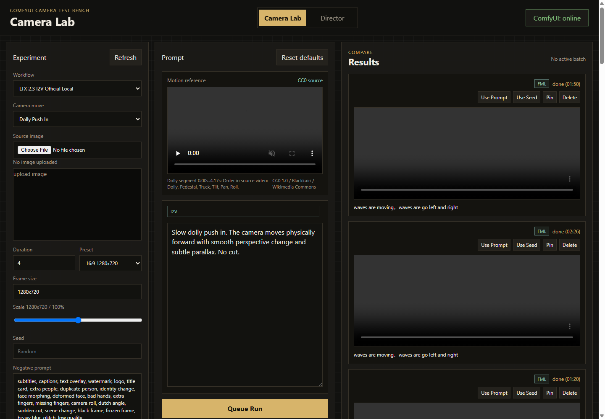

# Camera Lab

Camera Lab is a small local web UI for testing camera movement prompts and ComfyUI video workflows.

It runs as a Python HTTP server and talks to a local ComfyUI instance.



## Quick Start

### 1. Requirements

- Windows
- Python 3.10 or newer
- PowerShell
- A working local ComfyUI install

Start ComfyUI first. Camera Lab expects ComfyUI to be reachable at:

```text
http://127.0.0.1:8000
```

### 2. Create Local Config

Copy the example config:

```powershell
Copy-Item .env.example .env
```

Edit `.env` and set your own ComfyUI folder:

```text
COMFYUI_ROOT=<path-to-your-ComfyUI>
COMFYUI_URL=http://127.0.0.1:8000
```

Do not commit `.env`. It is ignored by git because it is machine-specific.

### 3. Install Python Dependency

```powershell
python -m pip install -r requirements.txt
```

### 4. Check Setup

Run:

```powershell
.\scripts\check_setup.ps1
```

If a check says `MISSING`, fix that item before starting Camera Lab. The most common issues are:

- `.env` was not created
- `COMFYUI_ROOT` points to the wrong folder
- ComfyUI is not running
- Required LTX models are missing
- Required custom nodes or workflow files are missing

### 5. Start Camera Lab

```powershell
.\scripts\start_camera_lab.ps1 -Open
```

Default URL:

```text
http://127.0.0.1:1234
```

Use another port if needed:

```powershell
.\scripts\start_camera_lab.ps1 -p 9000 -Open
```

### 6. Stop Camera Lab

```powershell
.\scripts\stop_camera_lab.ps1
```

Use a custom port if you started one:

```powershell
.\scripts\stop_camera_lab.ps1 -p 9000
```

## If PowerShell Blocks Scripts

Run this once for your Windows user:

```powershell
Set-ExecutionPolicy -Scope CurrentUser RemoteSigned
```

You can also start the server directly:

```powershell
python server\camera_lab_server.py --port 1234
```

Then open:

```text
http://127.0.0.1:1234
```

## Browser E2E Tests

Camera Lab uses Playwright for browser-level smoke tests of the web UI.

Install Node dependencies and the Chromium test browser:

```powershell
npm install
npx playwright install chromium
```

Run the E2E suite:

```powershell
npm run test:e2e
```

The current E2E smoke test starts the local server and verifies that the public Camera Lab controls load.

## Expected ComfyUI Layout

Camera Lab reads these paths from `COMFYUI_ROOT`:

- `input`
- `output`
- `models`
- `user\default\workflows`
- `.venv\Lib\site-packages\comfyui_workflow_templates_media_video\templates`
- `custom_nodes\Comfyui_TTP_Toolset`

The setup checker verifies the important paths and files.

## Workflow Sources

The frontend workflow dropdown is populated by `WORKFLOWS` in `server/camera_lab_server.py`.

Current workflow sources are:

- Official ComfyUI workflow templates under `COMFYUI_ROOT`.
- Runtime builders in `server/camera_lab_server.py`.
- App-owned workflow JSON files under `workflows/app/`.
- A local Director workflow installed under the user's ComfyUI workflow folder.

Files under `workflows/experimental/` are research references and are not automatically shown in the frontend workflow dropdown.

## Included

- `server/`: Python backend, local HTTP server, and ComfyUI bridge.
- `frontend/`: static browser UI served by the Python backend.
- `scripts/`: Windows setup, start, and stop helpers.
- `workflows/app/`: checked-in ComfyUI workflows used by Camera Lab itself.
- `workflows/experimental/`: experimental Director / IC-LoRA workflow references.
- `assets/references/`: small bundled images used by built-in examples.
- `prompts/`: reusable prompt templates and negative prompts.
- `docs/`: screenshots and research notes.
- `tests/`: Python unit tests and Playwright smoke tests.
- `dependency-manifest.json`: machine-readable setup summary for coding agents.
- `AGENTS.md`: concise implementation notes for coding agents.

## Repository Folders

The repository is organized so public, reusable files are separated from local run output:

- Application code lives in `server/` and `frontend/`.
- Camera Lab workflow files live in `workflows/app/`.
- Small example assets live in `assets/`.
- Temporary runs, uploads, preview renders, prompt smoke tests, generated videos, and logs belong in `tasks/`.

`tasks/` is local-only and ignored by git. Do not put required public assets there. If a workflow or reference image is needed by the app or by users, keep it under `workflows/` or `assets/references/`.

Photography workflow material is currently test-only and is not included as a public workflow reference.

## Runtime Data

Generated runs and uploaded files are written under:

- `tasks/camera_lab_runs/`
- `tasks/camera_lab_uploads/`

Those folders are ignored by git.
