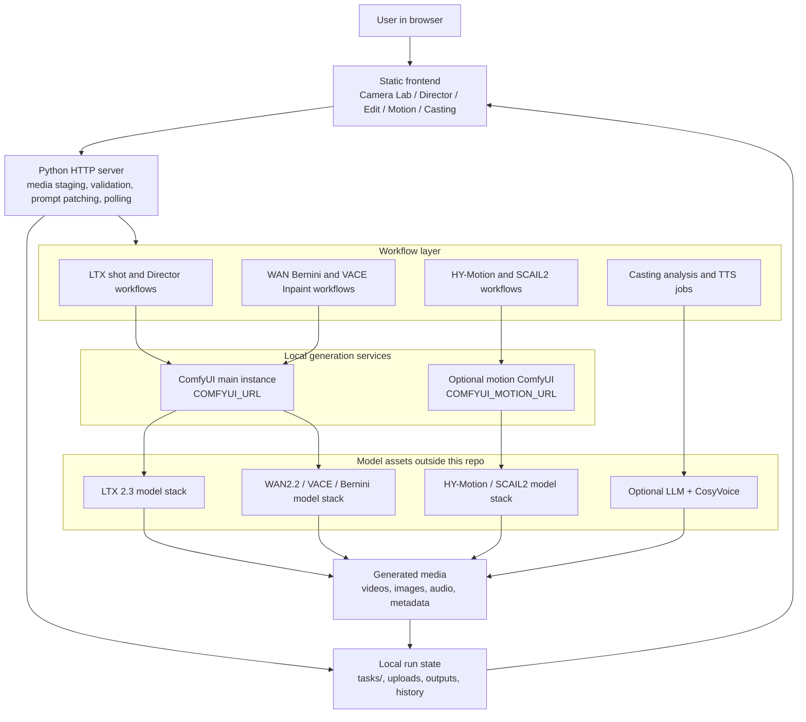

# Architecture

Camera Lab is a local web workspace for building ComfyUI-powered AI video shots.
It runs as a lightweight Python HTTP server, serves a static frontend, stages
media locally, patches workflow prompts, submits them to ComfyUI, polls results,
and records run history.

## System Architecture

## Backend

- Entry point: `server/camera_lab_server.py`
- Serves static files from `frontend/`
- Accepts generation requests
- Validates and stages media into ComfyUI input folders
- Builds or patches workflow API payloads
- Submits prompts to ComfyUI
- Polls results and writes local run history under `tasks/`

## Frontend

- Static browser UI in `frontend/`
- Workspaces: Camera Lab, Director, Edit, Motion, Casting
- Talks only to the Camera Lab HTTP server
- Reuses result history, upload controls, preview modals, and edit handoff menus

## Workflow Layer

Workflow sources are either:

- Checked-in JSON under `workflows/app/`
- Runtime builders inside `server/camera_lab_server.py`

The app patches workflows at request time instead of requiring users to edit
ComfyUI workflows manually.

## Runtime Data

Generated runs and uploaded files are written under:

- `tasks/camera_lab_runs/`
- `tasks/camera_lab_uploads/`

Those folders are ignored by git.

## ComfyUI Boundary

Camera Lab does not vendor ComfyUI, models, or custom nodes. It expects ComfyUI
to be installed locally or provided by Docker. Model files remain outside this
repository.

