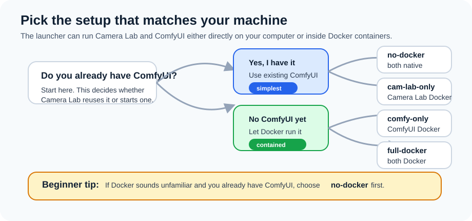
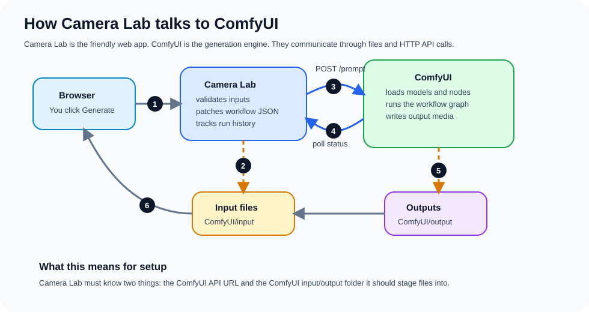
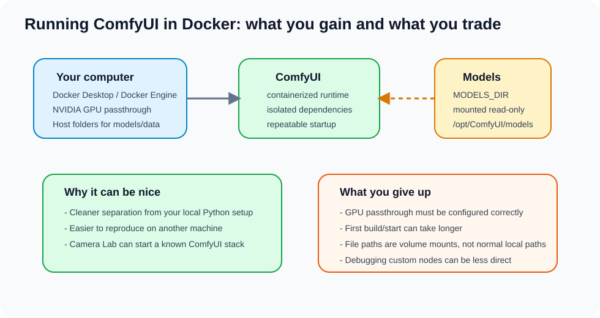
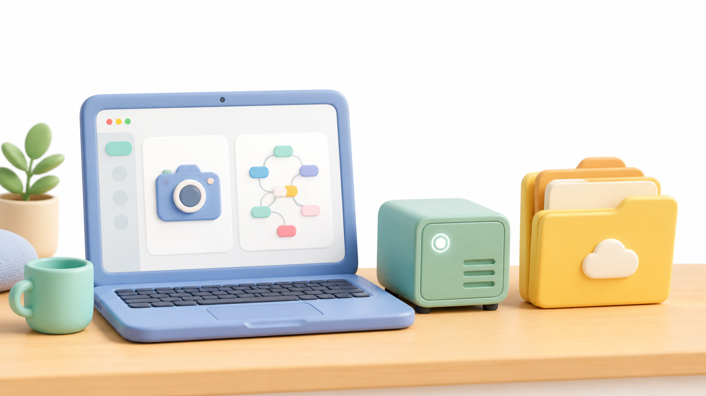
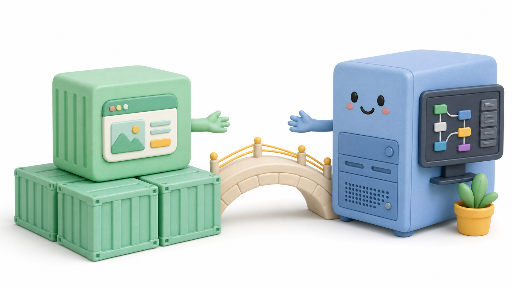
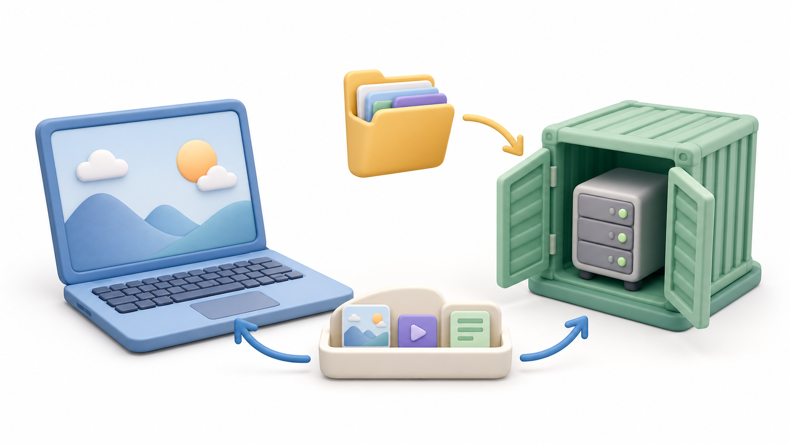
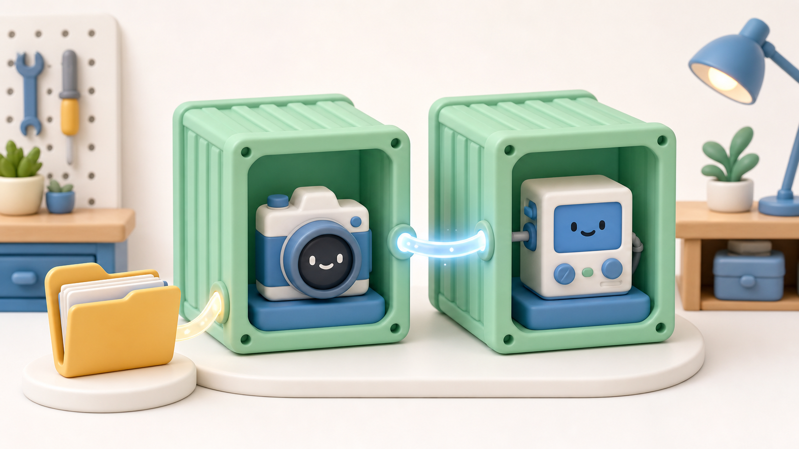

# Installation Guide

The easiest way to start Camera Lab is the launcher:

```powershell
python scripts/launch.py
```

The launcher checks your GPU, VRAM, ComfyUI connection, module readiness, and
model visibility. It does **not** download models, install ComfyUI, or change
your existing ComfyUI installation.


Use these safe commands first:

```powershell
python scripts/launch.py --assess-only
python scripts/launch.py --dry-run
```

`--assess-only` prints the hardware/module/model report. `--dry-run` prints the
commands it would run without starting Docker or Camera Lab.

## What Is Docker?

Docker is an app that runs software in isolated containers. A container is like
a small packaged environment for an app and its dependencies. Camera Lab can use
Docker so ComfyUI and/or Camera Lab run without being mixed into your normal
Python environment.

You do **not** need Docker if you already have ComfyUI installed and you are
comfortable running Camera Lab directly with Python. In that case, choose:

```text
Existing ComfyUI + native Camera Lab
```

You may want Docker if:

- You do not have ComfyUI installed yet.
- You want Camera Lab or ComfyUI isolated from your normal Python setup.
- You are comfortable installing Docker Desktop and letting Docker manage containers.

If Docker is new to you, the simplest path is usually:

1. Install ComfyUI normally using the official ComfyUI instructions.
2. Use Camera Lab's `Existing ComfyUI + native Camera Lab` mode.

Docker downloads:

- Windows/macOS: <https://www.docker.com/products/docker-desktop/>
- Linux Docker Engine: <https://docs.docker.com/engine/install/>

> [!WARNING]
> If you already have a working native ComfyUI setup, do not casually install
> new custom nodes, replace Python packages, or rewrite model/workflow folders
> inside that same ComfyUI just to try Camera Lab. A workflow that works today
> can break when node versions, Python dependencies, model paths, or workflow
> JSON expectations change. The safest first path for an existing ComfyUI user
> is `no-docker`, which connects Camera Lab to your current ComfyUI without
> trying to replace it.

## Choose An Install Path



Camera Lab supports four install paths:

| Your situation | What runs natively | What runs in Docker | Launcher mode |
|---|---|---|---|
| You already have ComfyUI and want the simplest setup | ComfyUI + Camera Lab | Nothing | `no-docker` |
| You already have ComfyUI but want Camera Lab isolated | ComfyUI | Camera Lab | `cam-lab-only-docker` |
| You do not have ComfyUI but want Camera Lab native | Camera Lab | ComfyUI | `comfy-only-docker` |
| You do not have ComfyUI and want everything isolated | Nothing | ComfyUI + Camera Lab | `full-docker` |

Beginner recommendations:

- If you already use ComfyUI, start with `no-docker`.
- If you do not have ComfyUI, start with `full-docker`.
- Use `comfy-only-docker` only if you specifically want ComfyUI in Docker but Camera Lab running directly on your machine.
- Use `cam-lab-only-docker` only if your existing ComfyUI is reachable from Docker. Your ComfyUI must listen on `0.0.0.0`, usually by starting it with `--listen`.

## How Camera Lab Talks To ComfyUI



Camera Lab is the web app and orchestration layer. ComfyUI is the generation
engine. A normal run works like this:

1. Your browser sends a generation request to Camera Lab.
2. Camera Lab copies uploaded files into the ComfyUI input folder.
3. Camera Lab patches a workflow prompt and sends it to the ComfyUI API.
4. ComfyUI loads models and custom nodes, then runs the graph.
5. ComfyUI writes generated media into its output folder.
6. Camera Lab finds the output and shows it in the browser history.

This is why setup must get two things right:

- `COMFYUI_URL`: where the ComfyUI API is listening.
- `COMFYUI_ROOT`: the folder whose `input` and `output` directories Camera Lab should use.

## Docker ComfyUI Trade-Offs



Running ComfyUI in Docker can be convenient, but it is not a free upgrade. It
gives you a more isolated, repeatable runtime, but it also adds a container
layer between you and ComfyUI.

What you gain:

- Cleaner separation from your normal Python environment.
- A more repeatable ComfyUI runtime for Camera Lab.
- Easier cleanup because the service is containerized.

What you trade away:

- Docker GPU passthrough must be configured correctly.
- The first image build/start can take longer.
- File paths become Docker volume mounts, not normal local paths.
- Debugging custom nodes can be less direct than a native ComfyUI checkout.
- You still need models on the host; Docker mounts them, it does not magically provide them.
- If your native ComfyUI already works well, Docker may add more setup friction
  than value.

If you already have a stable ComfyUI install and Docker is unfamiliar, native
ComfyUI plus native Camera Lab is usually the happiest first path.

Dockerized ComfyUI is isolated from your native ComfyUI, which helps protect a
working local setup from dependency changes. The trade-off is that Dockerized
ComfyUI is a separate environment with its own custom nodes and dependency
versions, so it may behave differently from your native ComfyUI.

## Check What Camera Lab Sees

Run:

```powershell
python scripts/launch.py --assess-only
```

The model guide uses these tags:

- `[ok]`: ComfyUI can already see the model.
- `[missing]`: ComfyUI is running, but this model is missing.
- `[needed]`: ComfyUI was not detected, so Camera Lab can only show what will be needed later.

Model paths are relative to your ComfyUI models folder. For example:

```text
models/checkpoints/ltx-2.3-22b-dev-fp8.safetensors
```

means:

```text
<your ComfyUI folder>/models/checkpoints/ltx-2.3-22b-dev-fp8.safetensors
```

For Docker modes, `MODELS_DIR` is the host folder that contains those model
subfolders. Docker mounts it inside the ComfyUI container at:

```text
/opt/ComfyUI/models
```

## Existing ComfyUI + Native Camera Lab



Use this path if you already have ComfyUI installed and running.

> [!TIP]
> This is the least invasive path for an existing ComfyUI setup. It does not
> install another ComfyUI or change your custom nodes; it only connects Camera
> Lab to the ComfyUI URL and folders you configure.

1. Start ComfyUI.
2. Make sure it is reachable at `http://127.0.0.1:8000`.
3. Create `.env` if it does not exist:

   ```powershell
   Copy-Item .env.example .env
   ```

4. Edit `.env`:

   ```text
   COMFYUI_ROOT=C:\path\to\your\ComfyUI
   COMFYUI_URL=http://127.0.0.1:8000
   ```

5. Install repo dependencies and workflows:

   ```powershell
   python scripts/agent_setup.py
   python scripts/install_workflows.py
   python scripts/check_setup.py
   ```

6. Preview the launch:

   ```powershell
   python scripts/launch.py --dry-run --mode no-docker
   ```

7. Start Camera Lab:

   ```powershell
   python scripts/launch.py --mode no-docker
   ```

## Existing ComfyUI + Docker Camera Lab



Use this path if you want Camera Lab in Docker but want to keep using your
existing ComfyUI.

1. Start ComfyUI with network listening enabled:

   ```powershell
   python main.py --listen 0.0.0.0 --port 8000
   ```

2. Copy the Camera Lab Docker env file:

   ```powershell
   Copy-Item docker\compose.camera-lab-only.env.example docker\compose.camera-lab-only.env
   ```

3. Edit `docker/compose.camera-lab-only.env`. On Docker Desktop, the ComfyUI URL is often:

   ```text
   COMFYUI_URL=http://host.docker.internal:8000
   ```

4. Preview:

   ```powershell
   python scripts/launch.py --dry-run --mode cam-lab-only-docker
   ```

5. Start:

   ```powershell
   python scripts/launch.py --mode cam-lab-only-docker
   ```

## Docker ComfyUI + Native Camera Lab



Use this path if you do not have ComfyUI installed, but you want Camera Lab to
run directly on your machine.

This path has the same ComfyUI-in-Docker trade-offs above: GPU passthrough,
volume mounts, and container debugging matter. If you already have a stable
native ComfyUI, prefer `no-docker` first.

1. Copy the ComfyUI Docker env file:

   ```powershell
   Copy-Item docker\compose.comfy-only.env.example docker\compose.comfy-only.env
   ```

2. Edit `docker/compose.comfy-only.env`:

   ```text
   MODELS_DIR=C:\path\to\your\ComfyUI\models
   COMFY_DATA_DIR=.\comfy-data
   COMFY_PORT=8188
   ```

   `MODELS_DIR` must point to a host folder that contains ComfyUI model
   subfolders like `checkpoints`, `diffusion_models`, `text_encoders`, `vae`,
   and `loras`.

   `COMFY_DATA_DIR` is where the containerized ComfyUI reads inputs and writes outputs:

   ```text
   COMFY_DATA_DIR/input  -> /opt/ComfyUI/input
   COMFY_DATA_DIR/output -> /opt/ComfyUI/output
   ```

   The launcher passes the same `COMFY_DATA_DIR` to native Camera Lab as
   `COMFYUI_ROOT`, so uploads land where the ComfyUI container can read them.

3. Install native Camera Lab dependencies:

   ```powershell
   python scripts/agent_setup.py
   ```

4. Preview:

   ```powershell
   python scripts/launch.py --dry-run --mode comfy-only-docker
   ```

5. Start:

   ```powershell
   python scripts/launch.py --mode comfy-only-docker
   ```

## Docker ComfyUI + Docker Camera Lab



Use this path if you want the most isolated setup.

This is the most contained path, but also the most Docker-dependent path. It is
best when you want isolation more than maximum simplicity.

1. Copy the full Docker env file:

   ```powershell
   Copy-Item docker\compose.env.example docker\compose.env
   ```

2. Edit `docker/compose.env`:

   ```text
   MODELS_DIR=C:\path\to\your\ComfyUI\models
   ```

3. Preview:

   ```powershell
   python scripts/launch.py --dry-run --mode full-docker
   ```

4. Start:

   ```powershell
   python scripts/launch.py --mode full-docker
   ```

5. Open Camera Lab:

   ```text
   http://127.0.0.1:8000
   ```

## Common Setup Problems

### ComfyUI Was Not Detected

- Start ComfyUI first.
- Check that `COMFYUI_URL` is correct.
- For `cam-lab-only-docker`, start ComfyUI with `--listen 0.0.0.0` and use a container-reachable URL such as `http://host.docker.internal:8000`.

### MODELS_DIR Is Missing Or Does Not Exist

- Edit the relevant Docker env file.
- Set `MODELS_DIR` to the host folder that contains your ComfyUI model subfolders.
- Do not point it at one model file; point it at the whole `models` folder.

### A Model Is Listed As Missing

- Download or copy that model manually.
- Put it at the path shown by the model guide.
- Restart or refresh ComfyUI if it does not see the new model.

### Docker Is Not Available Or Not Running

- Start Docker Desktop on Windows or macOS.
- On Linux, make sure the Docker daemon is running.
- For NVIDIA GPUs in Docker, verify GPU passthrough:

  ```powershell
  docker run --rm --gpus all nvidia/cuda:12.4.1-base-ubuntu22.04 nvidia-smi
  ```

## Stop Services

For native Camera Lab:

```powershell
python scripts/stop_camera_lab.py
```

For Docker modes:

```powershell
docker compose --env-file docker/compose.env down
docker compose -f docker-compose.comfy-only.yml --env-file docker/compose.comfy-only.env down
docker compose -f docker-compose.camera-lab-only.yml --env-file docker/compose.camera-lab-only.env down
```
